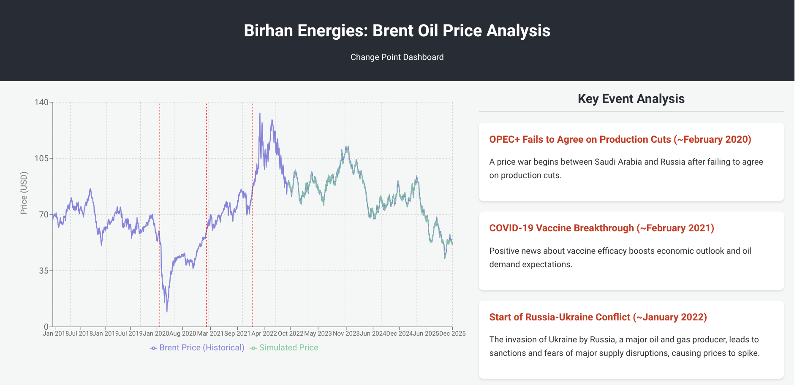

# Brent Oil Price Analysis: Change Point Detection

## Project Overview

This project analyzes the historical prices of Brent oil to identify statistically significant structural breaks (change points) and associate them with major geopolitical and economic events. The goal is to provide data-driven insights for investors, policymakers, and energy sector stakeholders at Birhan Energies.

The analysis uses a Bayesian Change Point model built with PyMC to detect shifts in price and volatility. The final results are presented in an interactive web dashboard built with Flask and React.

  

---

## Key Features

- **Bayesian Change Point Analysis:** Uses a multi-point model in PyMC to automatically detect structural breaks in the 2018-2022 price series.
- **Event Correlation:** Automatically associates detected change points with a curated list of major global events.
- **Interactive Dashboard:** A full-stack web application that visualizes the historical price data, detected change points, and a forward-looking simulation.
- **Responsive Design:** The dashboard layout adapts for optimal viewing on both desktop and mobile screens.
- **Reproducible Environment:** The project is fully containerized with a `requirements.txt` file for the Python environment.

---

## Project Structure

The repository is organized into a data analysis section and a dashboard application section.

```
birhan_energies_analysis/
├── dashboard/
│   ├── backend/          # Flask API for serving analysis results
│   └── frontend/         # React application for the dashboard UI
│
├── data/
│   ├── brent_prices.csv  # Raw Brent oil price data (1987-2022)
│   └── key_events.csv    # Curated list of major global events
│
├── notebooks/
│   └── brent_oil_analysis.ipynb # Jupyter Notebook with the full analysis
│
├── .gitignore            # Specifies files for Git to ignore
├── README.md             # This project overview
└── requirements.txt      # Python package dependencies
```

---

## How to Run This Project

### Prerequisites

- Python 3.9+ and `pip`
- A Python virtual environment tool (`venv`)
- Node.js and `npm`

### 1. Setup the Python Backend

First, set up the virtual environment and install the required Python packages.

```bash
# Clone the repository
# git clone <your-repo-url>
# cd birhan_energies_analysis

# Create and activate the virtual environment
python3 -m venv env
source env/bin/activate

# Install Python dependencies
pip install -r requirements.txt
```

### 2. Run the Data Analysis

The core analysis is in the Jupyter Notebook. To generate the `analysis_results.json` file needed by the backend, you must run the notebook.

```bash
# Install jupyter and the kernel
pip install jupyterlab ipykernel
python -m ipykernel install --user --name=birhan_energies

# Start JupyterLab
jupyter-lab
```

Inside JupyterLab, open `notebooks/brent_oil_analysis.ipynb` and run all the cells. This will create the `dashboard/backend/analysis_results.json` file.

### 3. Run the Dashboard

The dashboard requires two terminal windows running concurrently.

**Terminal 1: Start the Flask Backend**

```bash
# Make sure your virtual environment is active
source env/bin/activate

# Navigate to the backend folder
cd dashboard/backend

# Run the server
python app.py
```
The backend will now be running on `http://127.0.0.1:5000`.

**Terminal 2: Start the React Frontend**

```bash
# Navigate to the frontend folder
cd dashboard/frontend

# Install node modules
npm install

# Start the development server
npm run dev
```
The frontend application will open in your browser, usually at `http://localhost:5173`.